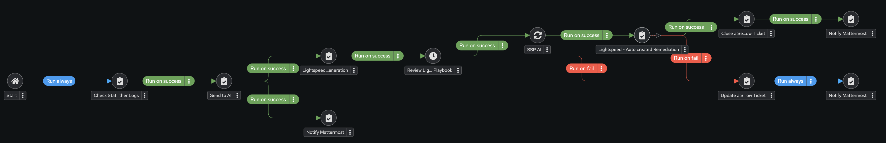

# Ansible-AI

Ansible AI Response Workflow Example

Playbooks to call:
Workflow requires Vars:
vm_name
service_issue

Playbooks to run main flow:

check_status.yml -> ai_communication.yml -> lightspeed-request.yml -> Admin Approval -> Repo Sync -> lightspeed-response.yml

Notify Mattermost playbook: https://github.com/shadowman-lab/Ansible-Eventdriven/blob/main/mattermost.yml

ServiceNow Update Ticket: https://github.com/shadowman-lab/Ansible-SNOW/blob/main/ServiceNowticket_inprogress.yml

ServiceNow Close Ticket: https://github.com/shadowman-lab/Ansible-SNOW/blob/main/ServiceNowticket_close.yml
